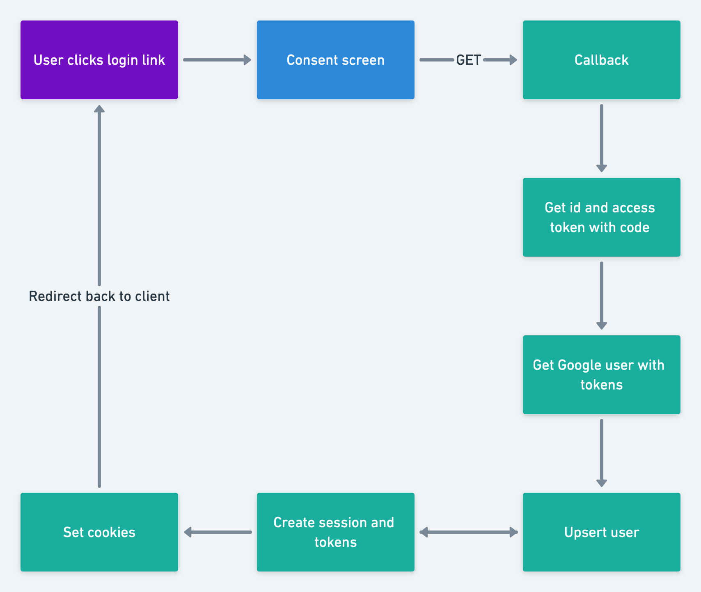

# 🔐 Google OAuth 2.0 Authentication with Node.js and Express

This project demonstrates how to implement **Google OAuth 2.0** authentication using **Node.js**, **Express**, **MongoDB**, and **express-session**. It allows users to sign in with their Google accounts and securely maintain a session.

---
## what is OAuth: 
it is a protocol used to share user authorization accross differnt systms based on sso (single sign on: sign in once and and you will have access in differnt systems )

## Example: 
twitter asks you if you want your contacts from gmail:                                               
when you approve:                                           
twitter asks gmaile the contacts                                       
the user authnticate by google                                          
gmail send the user consent screen to ensure that the user agree to send this resource to twitter                         
when you approve: google send code to twitter , twitter use it with his id and secret (as username and password given from google) to ask a token, twitter takes the token to connect with gmail to take the contacts.

## OAuth Members: 
- resource owner: User
- Client: twitter
- authorize server: google
- resource server: gmail
- scope: what the client want to access from the resourc eserver
  

##  OAuth 2.0 Flow Explained

1. **User clicks "Sign in with Google"** on the client.
2. The client sends authorization request to the authrization server with the clientid, scope, redirect url. as aquery
3. the user authnticate to the authrization server
4. The browser is redirected to **Google's authorization consent  page**.
5. User consents to give access (approve) → Google redirects back to `REDIRECT_URI` with a `code` in the query string  
6. Backend:
   - Verifies the `state` matches the session (CSRF protection).
   - sends request to authrization server with the code and clientid and secret in the body of the post request to ask the idtoken and access token
   - Decodes the `id_token` to get the user information and checks `email_verified`.
   - or use the access token to connect the resource server to get the data 
   - upsert the user in database.
   - Creates access and refresh tokens (optional).
   - Sets cookies and redirects the user back to the frontend.

---

